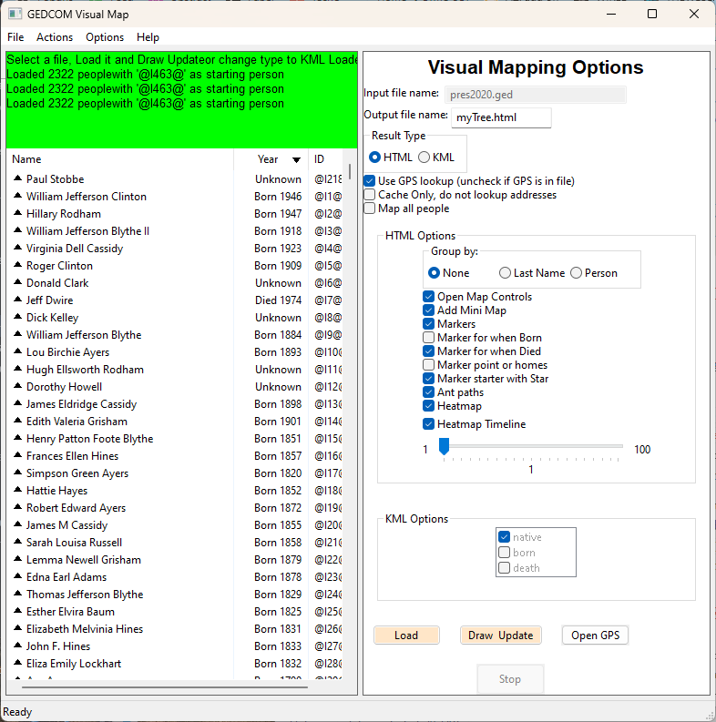
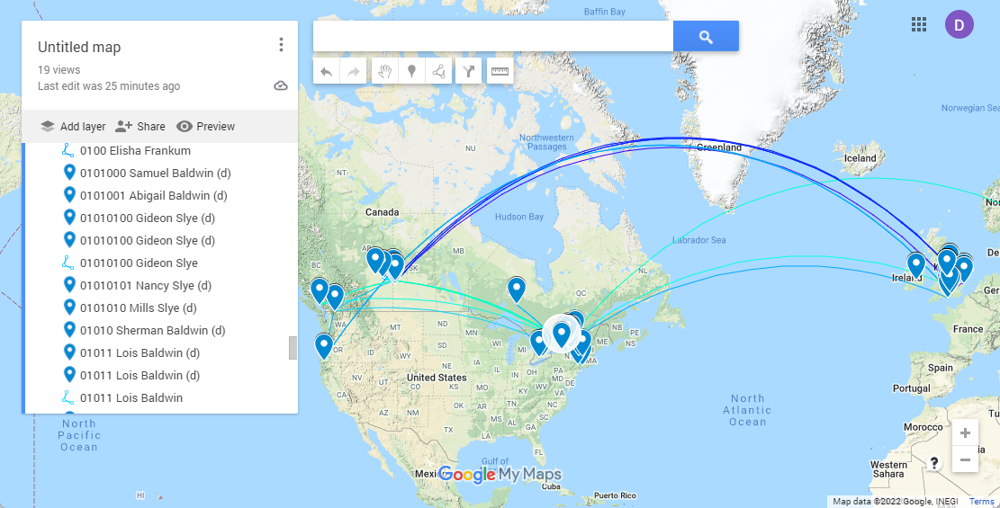
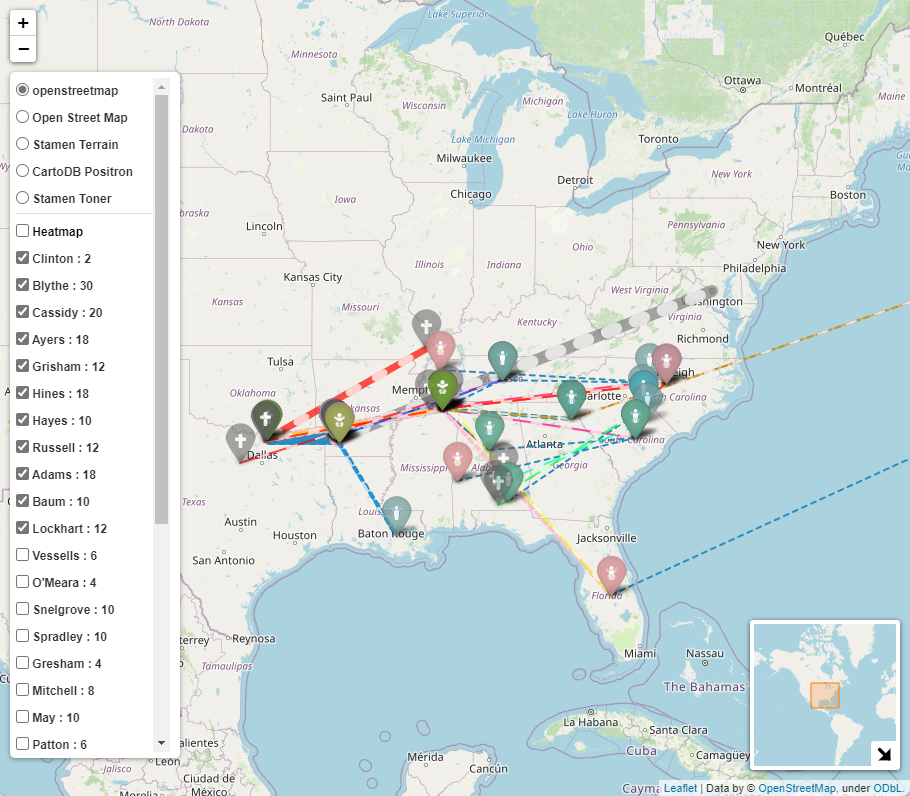

[![GitHub Activity][releases-shield]][releases]
[![License][license-shield]]([lisense])
![Project Maintenance][maintenance-shield]
[![GitHub Activity][commits-shield]][commits]

# gedcom-to-visualmap
### WIP, looking for feedback

Orginally forked from [https://github.com/lmallez/gedcom-to-map]

Read a GEDCOM file and translate the locations into GPS addresses.
The produces different KML map types which should timelines and movements around the earth.
The produces HTML file which is interactive..

This contains two interfaces: command-line and GUI (only tested on Windows)

# How to Run

1. Clone the repository:
```
$ git clone git@github.com:D-Jeffrey/gedcom-to-visualmap
$ cd gedcom-to-visualmap
```

2. Install dependencies:
```
$ pip install -r requirements.txt
```

3. Run the GUI interface:
```
cd gedcom-to-map
python gedcomVisualGUI.py 
```

Alternate 3. Start the command line  (Not recommended as there are so many options)
```
cd gedcom-to-map
python gedcom-to-map.py myhertitagetree.ged myTree -main "@I500003@" 
```

## GUI


To use the GUI version, `File- > Open` and select your .ged file.
Set your options in the GUI interface  
- Type in the Output file name (It saves to the same directory as the Load file).
- Result type drives the options mixture

Once you have selected your options, 
- click the `Load` button and it will start to load the GED and then resolve the addresses.
- `Draw Update` button is a 'Save' button.  For HTML it will trying and open the file with your web browser automatically.  For KML, it will save the file so you can load it onto a map.  (See below)
- `Open GPS` button will open the CSV file in Excel if you have it... (I'm thinking that does not work on a Mac)
- `Stop` will allow you to abort the Load/ Resolving of addresses without killing the GUI, allowing your to pick different options.

## Output to HTML using folium

 ### Usage
 
 ```
 usage: gedcom-to-map.py [-h] [-main MAIN] [-format {HTML,KML}] [-max_missing MAX_MISSING] [-max_line_weight MAX_LINE_WEIGHT] [-everyone] [-gpscache] [-nogps] [-nomarker] [-nobornmarker] [-noheatmap]
                        [-maptiletype {1,2,3,4,5,6,7}] [-nomarkstar] [-groupby {0,1,2}] [-antpath] [-heattime] [-heatstep HEATSTEP] [-homemarker] [-born] [-death]
                        input_file output_file

convert gedcom to kml file and lookup GPS addresses

positional arguments:
  input_file            GEDCOM file, usually ends at .ged
  output_file           results file, extension will be added if none is given

optional arguments:
  -h, --help            show this help message and exit
  -main MAIN            if this is missing it will use the first person in the GEDCOM file
  -format {HTML,KML}    type of output result for map format
  -max_missing MAX_MISSING
                        maximum generation missing (0 = no limit)
  -max_line_weight MAX_LINE_WEIGHT
                        Line maximum weight
  -everyone             Plot everyone in your tree

Geocoding:
  -gpscache             Use the GPS cache only
  -nogps                Do not lookup places using geocode to determine GPS, use built in GPS values

Folium Map as HTML (format HTML):
  -nomarker             Turn off the markers
  -nobornmarker         Turn off the markers for born
  -noheatmap            Turn off the heat map
  -maptiletype {1,2,3,4,5,6,7}
                        Map tile styles
  -nomarkstar           Turn off the markers starting person
  -groupby {0,1,2}      1 - Family Name, 2 - Person
  -antpath              Turn on AntPath
  -heattime             Turn on heatmap timeline
  -heatstep HEATSTEP    years per heatmap group step
  -homemarker           Turn on marking homes

KML processing:
  -born                 use place born for mapping
  -death                use place born for mapping
```
It produces a HTML file which is interactive and shows relationships betwenn childern and parents and where people lived 
over the years.  It includes a heatmap to show busiey places.  If you zoom in enough you can see the different markers 
which are overlayed on each other.


```
pip install -r requirements.txt
cd samples
python ..\gedcom-to-map\gedcom-to-map.py input.ged out  -format HTML -groupby 1
python ..\gedcom-to-map\gedcom-to-map.py input.ged out -main "@I0000@" -format KML

```

* HTML Output : [samples/output.html](samples/output.html)

## KML Example revised

* KML Output  : [samples/output.kml](samples/output.kml)

Go to https://www.google.ca/maps/about/mymaps  
- Click on `Getting Started`
- Click `Create a New Map`
- On Untitled map click on the `Import` options and open the your KML file
#### Note this does not work in Google Earth as the lines don't appear, not sure about other KML viewers.

The *`geodat-address-cache.csv`* file can be edited to feed back in new Addresses for GeoCoding.  Just edit or clear any column except the *Name* column to have it re-lookup that address.  Especially useful if you want to make a bad or old style name resolve to a new name/location.
If you do not have GPS location in your GEDCOM file, then use -born or -born -death so have it use the place where the person was born and/or died.

* Cache : [samples/geodat-address-cache.csv](samples/geodat-address-cache.csv)



```
cd samples
python ..\gedcom-to-map\gedcom-to-map.py pres2020.ged pres2020 -main "@I1@" -format HTML -groupby 1 -nomarkstar -antpath
```
* HTML Output  : [samples/pres2020-2.html](samples/pres2020-2.html)


```
python ..\gedcom-to-map\gedcom-to-map.py pres2020.ged pres2020-2 -main "@I676@" -format HTML -groupby 1 -nomarkstar -antpath
```

* KML Output  : [samples/pres2020-2.kml](samples/pres2020-2.kml)
```
python ..\gedcom-to-map\gedcom-to-map.py pres2020.ged pres2020-2 -main "@I676@" -format KML
```


## Complex Export of MyHeritage - intereactive map


## Issues
### GUI
- Sorting does not work correctly
- Cache Only checkboxes is not working
- Need to seperate the Load and GPS resolve steps
- Need to better detect change to the GPS cache file
- could be memory leak issues
- need to determine how do deal with very large HTML files

## Releases
### v0.1.0 
- Adjusted GUI and saving of cache file location
- Fixed issue if the cache did not already exist results in a ```
line 166, in saveAddressCache for a in range(0,len(self.addresslist)): 
TypeError: object of type 'NoneType' has no len()```


[license-shield]: https://img.shields.io/github/license/D-Jeffrey/gedcom-to-visualmap.svg?style=for-the-badge
[license]: LICENSE
[commits]: https://github.com/D-Jeffrey/gedcom-to-visualmap/commits
[commits-shield]: https://img.shields.io/github/commit-activity/y/D-Jeffrey/gedcom-to-visualmap?style=for-the-badge
[maintenance-shield]: https://img.shields.io/maintenance/yes/2023.svg?style=for-the-badge
[releases-shield]: https://img.shields.io/github/v/release/D-Jeffrey/gedcom-to-visualmap.svg?style=for-the-badge
[releases]: https://github.com/crowbarz/D-Jeffrey/gedcom-to-visualmap/releases