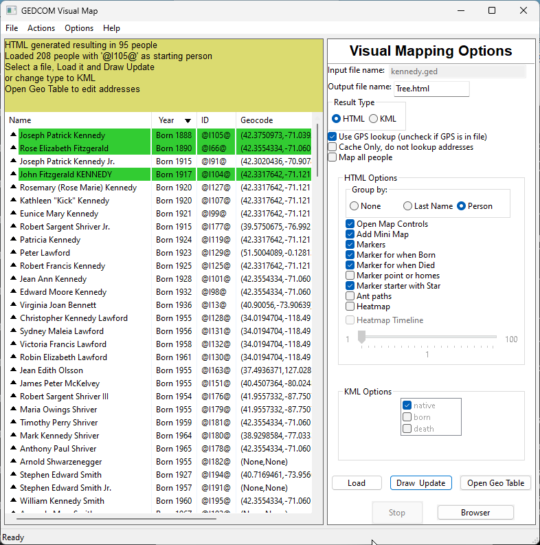
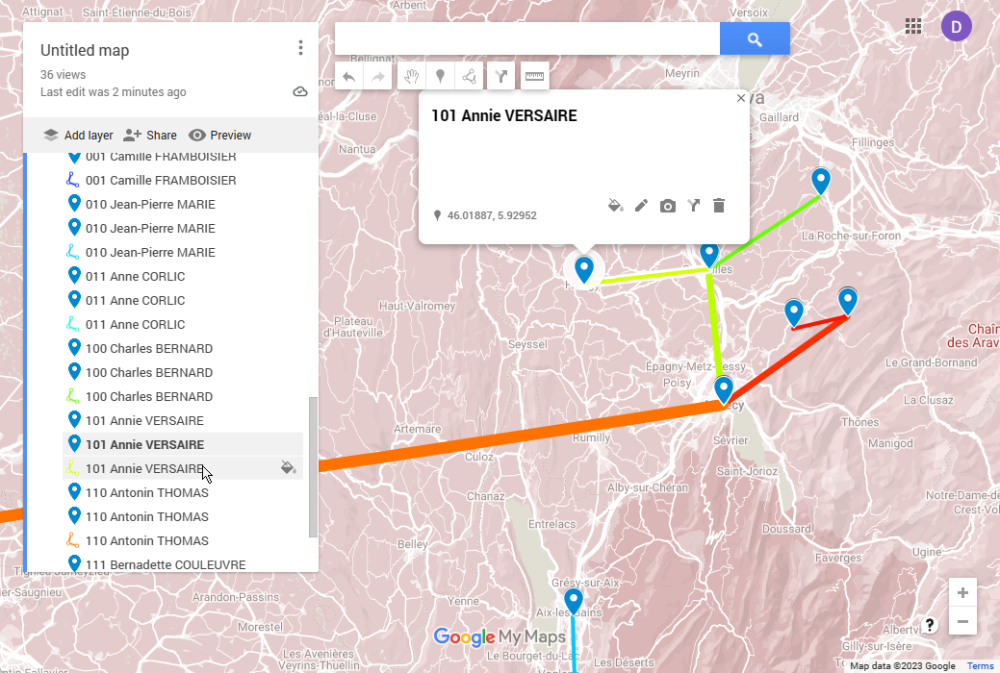
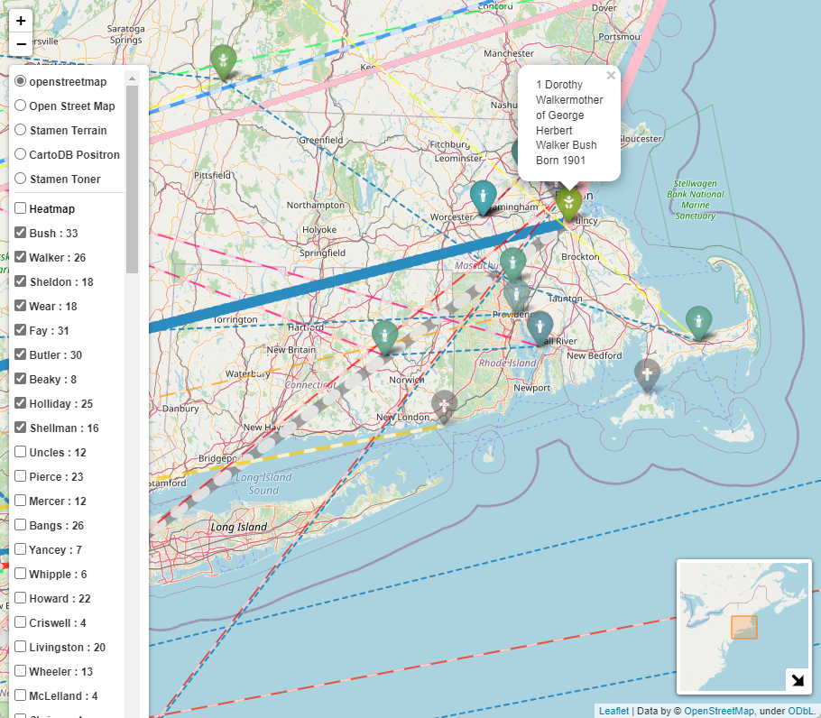
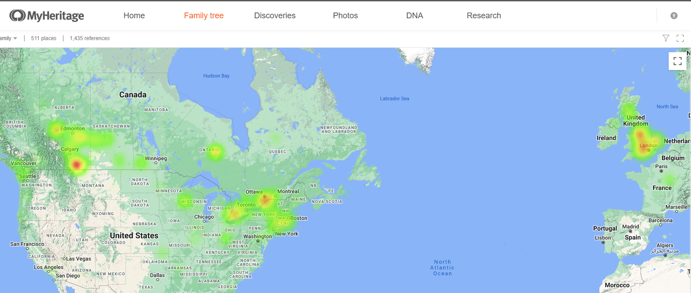
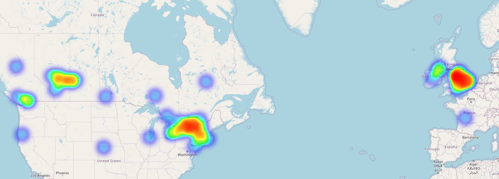

[![GitHub Activity][releases-shield]][releases]
[![License][license-shield]]([license])
![Project Maintenance][maintenance-shield]
[![GitHub Activity][commits-shield]][commits]

# gedcom-to-visualmap
### WIP, looking for feedback

Orginally forked from [https://github.com/lmallez/gedcom-to-map]

Read a GEDCOM file and translate the locations into GPS addresses.
The produces different KML map types which should timelines and movements around the earth.
The produces HTML file which is interactive..

This contains two interfaces: command-line and GUI (only tested on Windows)

# How to Run

Assuming you have Python installed otherwise... https://github.com/PackeTsar/Install-Python#readme

1. Clone the repository:
```
$ git clone https://github.com/D-Jeffrey/gedcom-to-visualmap
```
 - or -

Alternatively download the zip package of the latest [release](https://github.com/D-Jeffrey/gedcom-to-visualmap/releases) and unzip the package into a directory (such as gedcom-to-visualmap)

2. Install dependencies:
```
$ cd gedcom-to-visualmap
$ pip install -r requirements.txt
```

3. Run the GUI interface:
```
cd gedcom-to-map
python3 gedcomVisualGUI.py 
```

Alternate 3. Start the command line  (Not recommended as there are so many options)
```
cd gedcom-to-map
python3 gedcom-to-map.py /users/darren/documents/myhertitagetree.ged myTree -main "@I500003@" 
```

## GUI


To use the GUI version, `File- > Open` and select your .ged file.
Set your options in the GUI interface  
- Type in the Output file name (It saves to the same directory as the Load file).
- Result type drives the options mixture

Once you have selected your options, 
- click the `Load` button and it will start to load the GED and then resolve the addresses.
- `Draw Update` button is a 'Save' button.  For HTML it will try and open the file with your web browser automatically.  For KML, it will save the file so you can load it onto a map.  (See below)
- `Open GPS` button will open the CSV file in Excel if you have it... (I'm thinking that does not work on a Mac)  Make sure you close it before running again, or it may not be able to update the CSV file.
- `Stop` will allow you to abort the Load/ Resolving of addresses without killing the GUI, allowing you to pick different options.
- Using the left mouse click to select the starting person in (Star)
- Use the right click on list of people to bring up some known details and how it was geocoded
- When the people are loaded you can sort by the various columns by clicking on the column.  When the list of people is selected for display it is relative to this starting person, unless you select the `Map all people`
- You can resize the window (larger or maximized) to see more details about the people.
- When displaying people on the HTML map, you can choose to list them as single people, as a group by the last name or by their parent

## Output to HTML using folium

 ### Usage
 
 ```
 usage: gedcom-to-map.py [-h] [-main MAIN] [-format {HTML,KML}] [-max_missing MAX_MISSING] [-max_line_weight MAX_LINE_WEIGHT] [-everyone] [-gpscache] [-nogps] [-nomarker] [-nobornmarker] [-noheatmap]
                        [-maptiletype {1,2,3,4,5,6,7}] [-nomarkstar] [-groupby {0,1,2}] [-antpath] [-heattime] [-heatstep HEATSTEP] [-homemarker] [-born] [-death]
                        input_file output_file

convert gedcom to kml file and lookup GPS addresses

positional arguments:
  input_file            GEDCOM file, usually ends at .ged
  output_file           results file, extension will be added if none is given

optional arguments:
  -h, --help            show this help message and exit
  -main MAIN            if this is missing it will use the first person in the GEDCOM file
  -format {HTML,KML}    type of output result for map format
  -max_missing MAX_MISSING
                        maximum generation missing (0 = no limit)
  -max_line_weight MAX_LINE_WEIGHT
                        Line maximum weight
  -everyone             Plot everyone in your tree

Geocoding:
  -gpscache             Use the GPS cache only
  -nogps                Do not lookup places using geocode to determine GPS, use built in GPS values

Folium Map as HTML (format HTML):
  -nomarker             Turn off the markers
  -nobornmarker         Turn off the markers for born
  -noheatmap            Turn off the heat map
  -maptiletype {1,2,3,4,5,6,7}
                        Map tile styles
  -nomarkstar           Turn off the markers starting person
  -groupby {0,1,2}      1 - Family Name, 2 - Person
  -antpath              Turn on AntPath
  -heattime             Turn on heatmap timeline
  -heatstep HEATSTEP    years per heatmap group step
  -homemarker           Turn on marking homes

KML processing:
  -born                 use place born for mapping
  -death                use place born for mapping
```
It produces a HTML file which is interactive and shows relationships betwenn childern and parents and where people lived 
over the years.  It includes a heatmap to show busier places.  If you zoom in enough you can see the different markers 
which are overlayed on each other.


```
cd samples
python3 ..\gedcom-to-map\gedcom-to-map.py input.ged output  -format HTML -groupby 1
python3 ..\gedcom-to-map\gedcom-to-map.py input.ged output -main "@I0000@" -format KML

```

* HTML Output : [docs/output.html](docs/output.html)

## KML Example revised

* KML Output  : [samples/output.kml](samples/output.kml)

Go to https://www.google.ca/maps/about/mymaps  
- Click on `Getting Started`
- Click `Create a New Map`
- On `Untitled map` click on the `Import` options and open the your KML file
#### Note this does not work in Google Earth as the lines don't appear, not sure about other KML viewers.

The *`geodat-address-cache.csv`* file can be edited to feed back in new Addresses for GeoCoding.  Just edit or clear any column except the *Name* column to have it re-lookup that address.  Especially useful if you want to make a bad or old style name resolve to a new name/location.
If you do not have GPS location in your GEDCOM file, then use -born or -born -death so have it use the place where the person was born and/or died.

* Cache : [samples/geodat-address-cache.csv](samples/geodat-address-cache.csv)


```
cd 
python3 ..\gedcom-to-map\gedcom-to-map.py pres2020.ged pres2020 -main "@I1@" -format HTML -groupby 1 -nomarkstar -antpath
```


```
python3 ..\gedcom-to-map\gedcom-to-map.py pres2020.ged pres2020-2 -main "@I676@" -format HTML -groupby 1 -nomarkstar -antpath
```

* KML Output  : [samples/pres2020-2.kml](samples/pres2020-2.kml)
```
python3 ..\gedcom-to-map\gedcom-to-map.py pres2020.ged pres2020-2 -main "@I676@" -format KML
```

## Complex Export of MyHeritage - intereactive map


## Running on Linux
- [See Running on WSL](docs/running-on-wsl.md)

## Other Ideas
- [See Exploring Family trees](docs/otherlearnings.md)

## Comparing MyHeritage PedigreeMap Heatmap and GedcomVisual Heatmap
I noticed that the MyHeritage has added a heatmap a year or so ago and it has a lot of overlap with the GedcomVisual heatmap.

 and 


## TODO
- Add a treed hierarchy selector to enable people as groups and add expand/collapse to navigation
- add search to people grid
- more troubleshooting on the address lookup
  - better way to interact and refine the address resolution hints
  - move address hints in a configuration file
- option to remove 'lines' to not core points (such as RESI or other)
- Sort the Last Name by the highest number of people first or by distance from star
- create a marker animation by year (in time steps)
- better save the state of the options for next use
- in Person dialog show something for people still alive (vs None or Unknown)
- remember the starting person next time the same GED is opened
- add histical timeline and reference events in the area from https://www.vizgr.org/historical-events/ & https://github.com/dh3968mlq/hdtimelines/

## Issues
- Marriage is not read correctly all the time, does not deal with multiple marriages
- Sorting does not work after the graph is created

### GUI
- Need to separate the Load and GPS resolve steps
- Need to better detect change to the GPS cache file
- need better interaction with buttons and menu selections
- could be memory leak issues
- need to determine how do deal with very large HTML files
- logging panel leaks over the people grid


## Releases
### v0.2.4
- Change the HTML layer to deal with license changes to Leaflet map layers
- Added save state to config file
- finally got error messages in color
- improved logging
### v0.2.4
- Major performance increases
- Improved sorting for Last Name, People and None
- May have fixed busy icon
- Code refactors
- fine tune person dialog
- #bug - loading pres2020.ged and sorting on ID, may be other cases
- Improved Statistics Summary
### v0.2.3.5
- Adjusted Sorting for People list, adjusted adddress and year value for unknown.
- Try and fix the busy icon
- Error catching for parsing input of Gedcom files
- fixed - Uses the correct cache file from the Selected input GED directory
- file selection dialog automatically opens file
### v0.2.3.4
- Added dynamic highlighting based on main selection for HTML
- Added Statistics menu under Actions
### v0.2.3.3
- Adjustable GUI Font (See const.py to set it)
### v0.2.3
- re-org the project files
### v0.2.2
- corrected imports (removed gedcom package dependacy) and requirements.txt (again)
- on Linux sample
- more pylint
- fixed sorting of people

### v0.2.1
- Added support for Windows and Mac open of CSV
- more issues with cache, the first time you run it in the new directory
- added Kennedy samples
- improved setup.py
### v0.2.0
- fixed requirements.txt
- Add highlighting of people used in the draw
- Major improvements to KML Exporting
- improved feedback loop on loading in Visual
- Fixed issue with selection (broken in 0.1.2), fix issue with caching
- Added Legend (Needs work)
### v0.1.2
- New details dialog about people, fixed issues with GPS lookup, options 
- adjusted logging (Need more work)
- lots of linting work, bug fixes for addresses. 
- Still needs a lot work.
### v0.1.1
- Folded in GUI bugs from @rajeeshp & @frankbracq
### v0.1.0 
- Adjusted GUI and saving of cache file location
- Fixed issue if the cache did not already exist results in a ```
line 166, in saveAddressCache for a in range(0,len(self.addresslist)): 
TypeError: object of type 'NoneType' has no len()```


[license-shield]: https://img.shields.io/github/license/D-Jeffrey/gedcom-to-visualmap.svg?style=for-the-badge
[license]: LICENSE
[commits]: https://github.com/D-Jeffrey/gedcom-to-visualmap/commits
[commits-shield]: https://img.shields.io/github/commit-activity/y/D-Jeffrey/gedcom-to-visualmap?style=for-the-badge
[maintenance-shield]: https://img.shields.io/maintenance/yes/2023.svg?style=for-the-badge
[releases-shield]: https://img.shields.io/github/v/release/D-Jeffrey/gedcom-to-visualmap.svg?style=for-the-badge
[releases]: https://github.com/crowbarz/D-Jeffrey/gedcom-to-visualmap/releases
