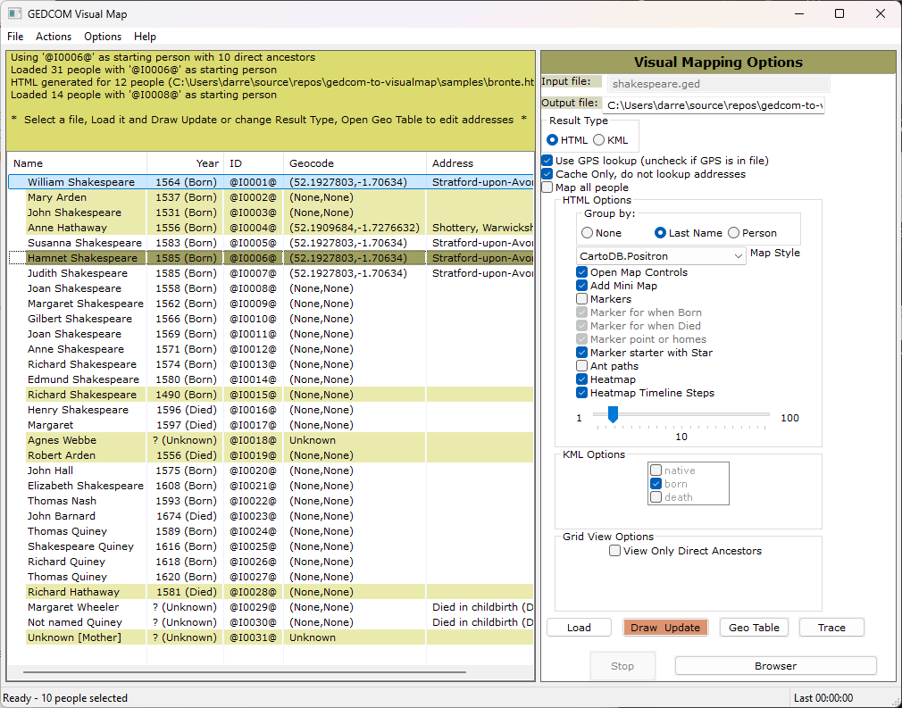
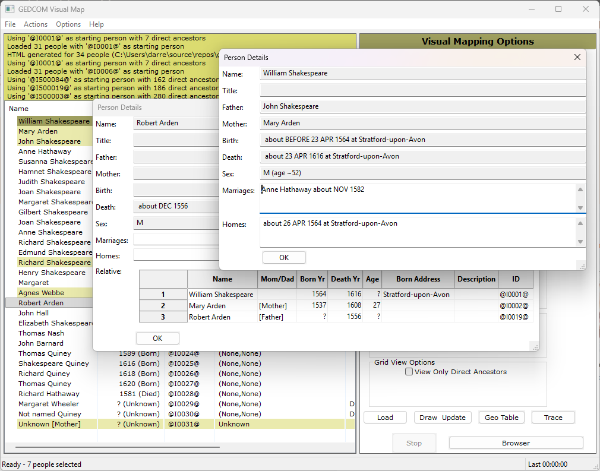
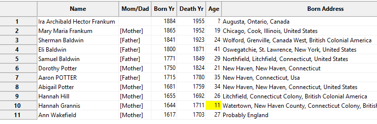
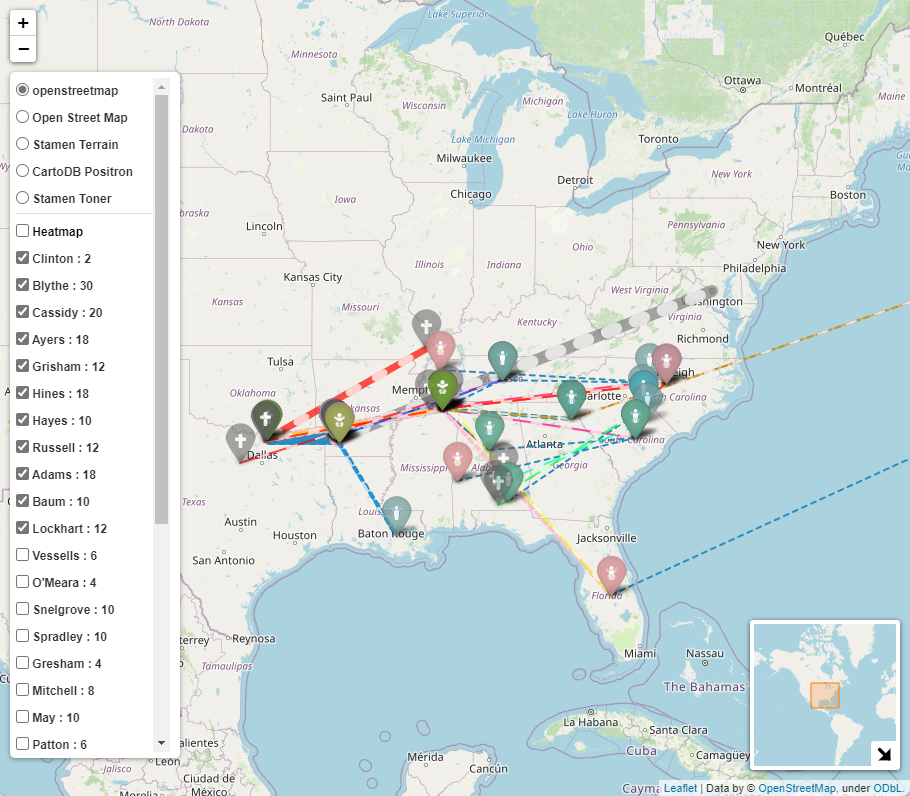
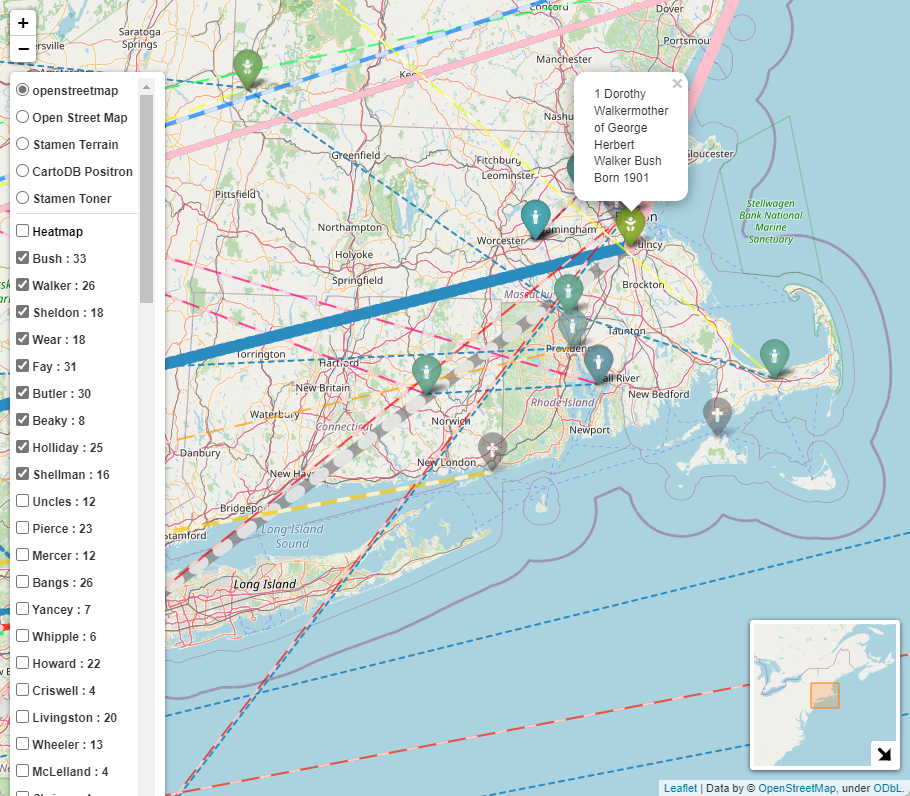
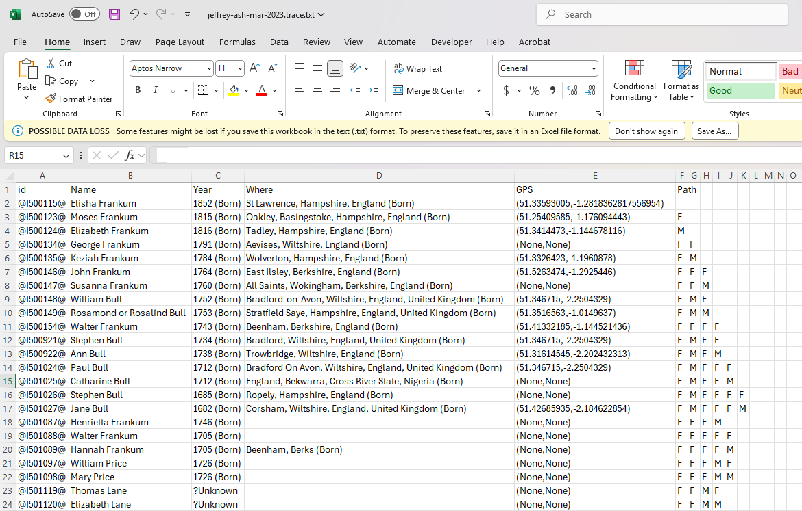
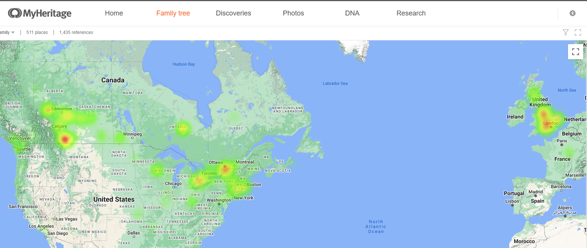

[![GitHub Activity][releases-shield]][releases]
[![License][license-shield]]([license])
![Project Maintenance][maintenance-shield]
[![GitHub Activity][commits-shield]][commits]


# gedcom-to-visualmap

Read a GEDCOM file and translate the locations into GPS addresses.
The produces different KML map types which should timelines and movements around the earth.
The produces HTML file which is interactive..

This contains two interfaces: command-line and GUI (only tested on Windows and Windows Sub-system for Linux).  Testing by @colin0brass on Mac

Orginally forked from [https://github.com/lmallez/gedcom-to-map]

# How to Run

Assuming you have Python installed otherwise... https://github.com/PackeTsar/Install-Python#readme

1. Clone the repository: (in powershell or bash)
```
git clone https://github.com/D-Jeffrey/gedcom-to-visualmap
cd gedcom-to-visualmap
```
-- or --

Alternatively download the zip package of the latest [release](https://github.com/D-Jeffrey/gedcom-to-visualmap/releases) and unzip the package into a directory (such as gedcom-to-visualmap)
2. Create virtual env for Python3 to run this

for Windows (powershell)
```
python3 -m venv venv
venv\bin\activate
```
-- or --
for Linux and Mac
```
python3 -m venv venv
source venv/bin/activate
```
3. Install dependencies:
```
python3 -m venv venv
source myvenv/bin/activate
pip install -r requirements.txt
```

4. Run the GUI interface:
```
cd gedcom-to-map
python3 gv.py 
```
--or--

Start the command line  (Not recommended as there are so many options)
```
cd gedcom-to-map
python3 gedcom-to-map.py /users/darren/documents/myhertitagetree.ged myTree -main "@I500003@" 
```

## GUI


To use the GUI version, `File- > Open` and select your .ged file.
Set your options in the GUI interface  
- Type in the Output file name (It saves to the same directory as the Load file).
- Result type drives the options mixture

Once you have selected your options, 
- click the `Load` button and it will start to load the GED and then resolve the addresses.
- `Draw Update` button is a 'Save' button.  For HTML it will try and open the file with your web browser automatically.  For KML, it will save the file so you can load it onto a map.  (See below)
- `Open GPS` button will open the CSV file in Excel if you have it... (I'm thinking that does not work on a Mac)  Make sure you close it before running again, or it may not be able to update the CSV file.
- `Stop` will allow you to abort the Load/ Resolving of addresses without killing the GUI, allowing you to pick different options.
- Using the `double-left-click` to select the starting person in (Star)

- `Geo Table` open the CSV file for the resolved and cached names.  You can edit the fields and change the `alt` column so substatute in a new name for alternate look up.
TODO Needs more description.
- `Trace` Create a list of the individuals from the starting person.  See below
- `Browser` Open the web browser using the last current output html file
- Use the `right-click` on the list of people to bring up some known **details** and how it 
was geocoded

The Age column can be very useful for testing to see if the parents are of the proper age, showing when thheir age when their child was born.


- When the people are loaded you can sort by the various columns by clicking on the column.  When the list of people is selected for display it is relative to this starting person, unless you select the `Map all people`
- You can resize the window (larger or maximized) to see more details about the people.
- When displaying people on the HTML map, you can choose to list them as 
  - single people, 
  - as a group by the last name 
  - or by their parents

### GUI Issues
Unix may not like the Font size of 8.  If you get errors, then change the font size in const.py  The interface needs a smaller font or it will throw 
off all the layout measurements.  (Need to add math to get actual font size)

# 
# Built using
| Project | Githib Repo | Documentation |
| --- | --- | --- |
| wxPython |  https://github.com/wxWidgets/Phoenix  | https://wxpython.org/
| ged4py | https://github.com/andy-z/ged4py  | https://ged4py.readthedocs.io
| simplekml | https://github.com/eisoldt/simplekml | https://app.readthedocs.org/projects/simplekml/
| geopy | https://github.com/geopy/geopy |https://geopy.readthedocs.io/en/latest/#geocoders |
| folium | https://github.com/python-visualization/folium | https://python-visualization.github.io/folium/latest/|
| xyzservices | https://github.com/geopandas/xyzservices | https://xyzservices.readthedocs.io/en/stable/index.html |


# Results
## KML Example revised
### Google Earth Online

* KML Output  : [samples/input.kml](samples/input.kml) using 'native' only
### ArcGIS Earth


Go to https://www.google.ca/maps/about/mymaps  
- Click on `Getting Started`
- Click `Create a New Map`
- On `Untitled map` click on the `Import` options and open your KML file
#### Note this does not work in Google Earth as the lines don't appear, not sure about other KML viewers.

The *`geodat-address-cache.csv`* file can be edited to feed back in new Addresses for GeoCoding.  Just edit or clear any column except the *Name* column to have it re-lookup that address.  Especially useful if you want to make a bad or old-style name resolve to a new name/location.
If you do not have GPS location in your GEDCOM file, then use -born or -born -death so have it use the place where the person was born and/or died.

* Cache : [samples/geodat-address-cache.csv](samples/geodat-address-cache.csv)



```
cd 
python3 ..\gedcom-to-map\gedcom-to-map.py pres2020.ged pres2020 -main "@I1@" -format HTML -groupby 1 -nomarkstar -antpath
```


```
python3 ..\gedcom-to-map\gedcom-to-map.py pres2020.ged pres2020-2 -main "@I676@" -format HTML -groupby 1 -nomarkstar -antpath
```

* KML Output  : [samples/pres2020-2.kml](samples/pres2020-2.kml)
```
python3 ..\gedcom-to-map\gedcom-to-map.py pres2020.ged pres2020-2 -main "@I676@" -format KML
```

## Trace button
Load your GED file.  Make sure that you have set an output file (click on the `Output File` label for quick access to the Save As).  Make sure you have selecte HTML mode (not KML).  Double click on a person to trace from that person back.  Then all the traced individuals will light up as green (with the starting person in grey).  Then click on the Trace button.  
This will produce a text file and the name will be shown be show in the Information section of the top left.  (Same directory as the output but with a different name '.trace.txt. instead of .HTML).  If you open this in Excel, you can reformat the last columns and then use that to identify the number of generations. 



## Heatmap Timeline

## Cluster Markers
If you turn off the Markers, then it will turn on Clustered markers.  Trying that out and seeing if this become a better way to do markers.  This is W, working towards leverage this feature more consistantly.


## Complex Export of MyHeritage - intereactive map


## Running on Linux
- [See Running on WSL](docs/running-on-wsl.md)

## Other Ideas
- [See Exploring Family trees](docs/otherlearnings.md)

## Comparing MyHeritage PedigreeMap Heatmap and GedcomVisual Heatmap
I noticed that the MyHeritage added a heatmap a year or so ago and it has a lot of overlap with the GedcomVisual heatmap.

 and 


# Output to HTML using folium

 ### Usage
 
 *Deprecated functionality*
 ```
 usage: gedcom-to-map.py [-h] [-main MAIN] [-format {HTML,KML}] [-max_missing MAX_MISSING] [-max_line_weight MAX_LINE_WEIGHT] [-everyone] [-gpscache] [-nogps] [-nomarker] [-nobornmarker] [-noheatmap]
                        [-maptiletype {1,2,3,4,5,6,7}] [-nomarkstar] [-groupby {0,1,2}] [-antpath] [-heattime] [-heatstep HEATSTEP] [-homemarker] [-born] [-death]
                        input_file output_file

convert gedcom to kml file and lookup GPS addresses

positional arguments:
  input_file            GEDCOM file, usually ends at .ged
  output_file           results file, extension will be added if none is given

optional arguments:
  -h, --help            show this help message and exit
  -main MAIN            if this is missing it will use the first person in the GEDCOM file
  -format {HTML,KML}    type of output result for map format
  -max_missing MAX_MISSING
                        maximum generation missing (0 = no limit)
  -max_line_weight MAX_LINE_WEIGHT
                        Line maximum weight
  -everyone             Plot everyone in your tree

Geocoding:
  -gpscache             Use the GPS cache only
  -nogps                Do not lookup places using geocode to determine GPS, use built in GPS values

Folium Map as HTML (format HTML):
  -nomarker             Turn off the markers
  -nobornmarker         Turn off the markers for born
  -noheatmap            Turn off the heat map
  -maptiletype {1,2,3,4,5,6,7}
                        Map tile styles
  -nomarkstar           Turn off the markers starting person
  -groupby {0,1,2}      1 - Family Name, 2 - Person
  -antpath              Turn on AntPath
  -heattime             Turn on heatmap timeline
  -heatstep HEATSTEP    years per heatmap group step
  -homemarker           Turn on marking homes

KML processing:
  -born                 use place born for mapping
  -death                use place born for mapping
```
It produces a HTML file which is interactive and shows relationships betwenn childern and parents and where people live 
over the years.  It includes a heatmap to show busier places.  If you zoom in enough, you can see the different markers 
which are overlayed on each other.


```
cd samples
python3 ..\gedcom-to-map\gedcom-to-map.py input.ged output  -format HTML -groupby 1
python3 ..\gedcom-to-map\gedcom-to-map.py input.ged output -main "@I0000@" -format KML

```

* HTML Output : [docs/output.html](docs/output.html)

## TODO
- Add a treed hierarchy selector to enable people as groups and add expand/collapse to navigation
- more troubleshooting on the address lookup
  - better way to interact and refine the address resolution hints
  - move address hints in a configuration file
- option to remove 'lines' to not core points (such as RESI or other)
- Sort the Last Name by the highest number of people first or by distance from star
- create a marker animation by year (in time steps)
- in Person dialog show something for people still alive (vs None or Unknown)
- add histical timeline and reference events in the area from https://www.vizgr.org/historical-events/ & https://github.com/dh3968mlq/hdtimelines/
- need to determine how do deal with very large HTML files.  Could use a limit of the number of people included in the selection
- Improve the KML version of the maps by grouping and improving the track of a person.  Add description bits to people in the KML version
- Improve marker clusters to have the proper icon
- Move some configuration to YAML to preserve customization over releases
- Major refactoring to make this *real* Python code

## Issues
- Marriage is not read correctly all the time, limitations with multiple marriages
- Linux does not save FileHistory
- People dialog displays only one parent after Draw Update
- list of background maps on Follium is not complete or presented, so currently only shows cartodbvoyager

### GUI
- Need to separate the Load and GPS resolve steps (currently reloads after 30 seconds of looking up values)

## Releases
### v0.2.6.6.x
- Working on KML functions and reworking GUI.  
- Fix HTML to use markers properly, optional timeline in KML
- Fixed issue when loading GED with missing children records 
### v0.2.6.4.1
- Fixed balloonflyto and added children to KML
### v0.2.6.4
- Fixed Logging Save settings
- Worked on KML to add FlyTo and improve features and labels
- working to refactor and enrich the kml results
- ballonflyto does not work yet
### v0.2.6.3
- Add images for Bourbon sample, bug fixes for f{}
### v0.2.6.2
- @colin0brass - Fixes to make it work properly on a Mac as well as a number of other pure programmer errors identified
- Improve Person Dialog (Displays picture if available)
### v0.2.6.1
- Added person attributes age
- Fixed age calc in Person dialog for parents, scroll grid on parents, click on a parent to bring up there details in a seperate window
- Improved last Name grouping on Folium maps, added soundex matching option
- Adjusted for variation in BC or negative dates
### v0.2.6.0
- New :main program gv.py
- fixed the logging level settings and reapply of log settings
- bumped folium version
- Added a dynamic Legend to replace the static pixely image
- Large refactored of FoliumExp, including - Tiles selection (move to GUI for selection), Added Cluster Markers, Additional icons for locations types, 
### v0.2.5.5
- Improved Person dialog
- Improved sorting by of GEDCOM ids in the grid
- Linux compatible fixing/testing (fixed SSL Verifcation errors, Geo Table button, get from github)
### v0.2.5.4
- Busy control is not working
- Refactored GUI classes into new modules gedcomDialogs
- minor bugs: Title layout, selected person coloring
- Fixed grid Sorting... for sure this time
- Fixed kml plotting errors
- Fixed colors on kml and  missing alpha
- Added color to kml markers and provide different born, death and native types
### v0.2.5.3
- Update Colors, and centralize code for color choices
- Person show list of all direct F/M + ancestors + years
- View only direct ancestors
- Sort code re-write
- Better save the state of the options for next use
- Removed icon at the front of people's name in grid
- Multiple marriage is better
- Load tested to 132K GEDCOM records loads in less than 5 minutes, 1600 people loads in 9 seconds.
### v0.2.5.2
- Improved Person info, now should delta between Active and displayed person
- Finally fixed the Sort issue (mostly).
- Sorts all dates include BC/B.C.
- Added a Find found to search names.
- Provides information about relation to selected person
### v0.2.5.1
- Worked on KML version of family loop detection
- Added option to open program for KML (or use a http address)
- Better saving of previous options, remembers selection Main person
### v0.2.5
- Performance increased, feedback, corrected double grid load
- Added detection for family loops
- Fixed Logging options so they work
- Added `Trace` to trace from selected person and dump to a text file
- Added `Save As` Dialog
- Enriched Help About
- Now tracking time
- Estimating the number of addresses to resolve
- Periodic saving of Address resolution (ever 5 minutes or 500 addresses)
### v0.2.4.2
- Refactoring
### v0.2.4.1
- Converted it back to Python 3.8 from 3.10
### v0.2.4
- Major performance increases
- Improved sorting for Last Name, People and None
- Change the HTML layer to deal with license changes to Leaflet map layers
- Added save state to config file
- finally got error messages in color
- improved logging
- fine tune person dialog
- May have fixed busy icon
- Code refactors
- #bug - loading pres2020.ged and sorting on ID, may be other cases
- Improved Statistics Summary
### v0.2.3.5
- Adjusted Sorting for People list, adjusted adddress and year value for unknown.
- Try and fix the busy icon
- Error catching for parsing input of Gedcom files
- fixed - Uses the correct cache file from the Selected input GED directory
- file selection dialog automatically opens file
### v0.2.3.4
- Added dynamic highlighting based on main selection for HTML
- Added Statistics menu under Actions
### v0.2.3.3
- Adjustable GUI Font (See const.py to set it)
### v0.2.3
- re-org the project files
### v0.2.2
- corrected imports (removed gedcom package dependacy) and requirements.txt (again)
- on Linux sample
- more pylint
- fixed sorting of people
### v0.2.1
- Added support for Windows and Mac open of CSV
- more issues with cache, the first time you run it in the new directory
- added Kennedy samples
- improved setup.py
### v0.2.0
- fixed requirements.txt
- Add highlighting of people used in the draw
- Major improvements to KML Exporting
- improved feedback loop on loading in Visual
- Fixed issue with selection (broken in 0.1.2), fix issue with caching
- Added Legend (Needs work)
### v0.1.x
- New details dialog about people, fixed issues with GPS lookup, options 
- Folded in GUI bugs from @rajeeshp & @frankbracq
- Adjusted GUI and saving of cache file location, Fixed issue if the cache file

[license-shield]: https://img.shields.io/github/license/D-Jeffrey/gedcom-to-visualmap.svg?style=for-the-badge
[license]: LICENSE
[commits]: https://github.com/D-Jeffrey/gedcom-to-visualmap/commits
[commits-shield]: https://img.shields.io/github/commit-activity/y/D-Jeffrey/gedcom-to-visualmap?style=for-the-badge
[maintenance-shield]: https://img.shields.io/maintenance/yes/2025.svg?style=for-the-badge
[releases-shield]: https://img.shields.io/github/v/release/D-Jeffrey/gedcom-to-visualmap.svg?style=for-the-badge
[releases]: https://github.com/crowbarz/D-Jeffrey/gedcom-to-visualmap/releases
