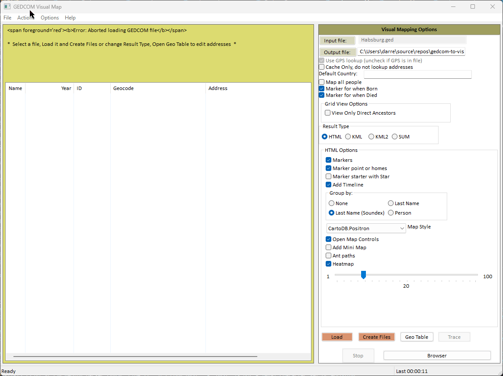
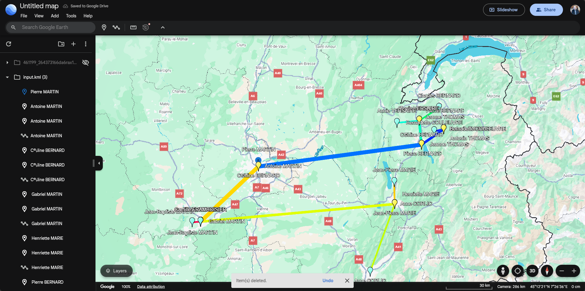
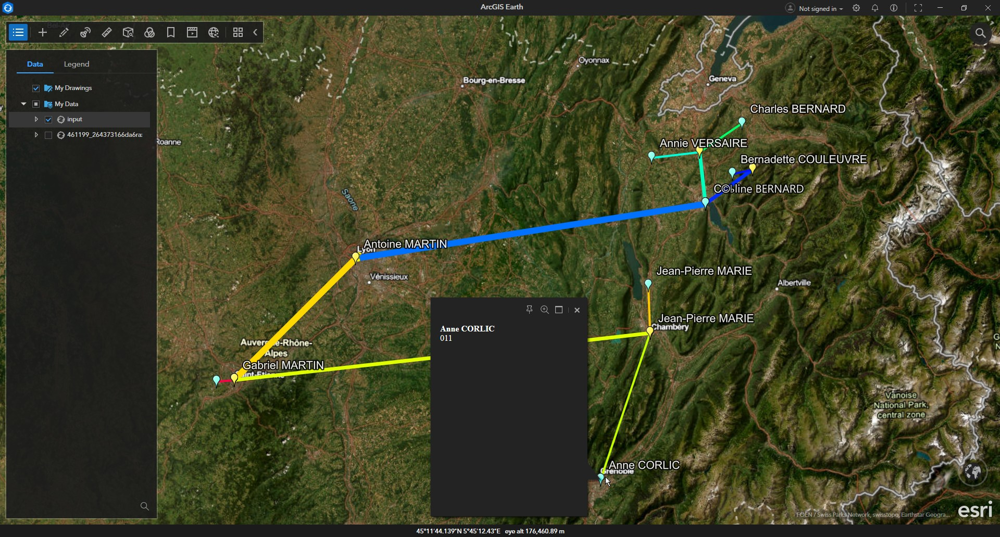
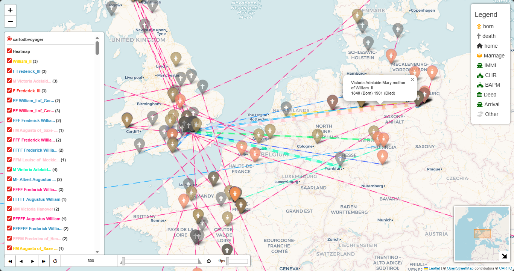
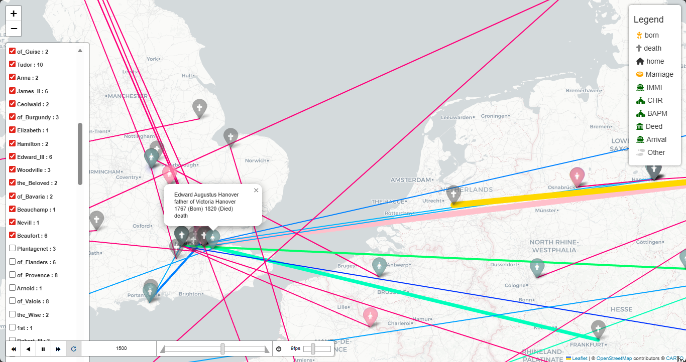
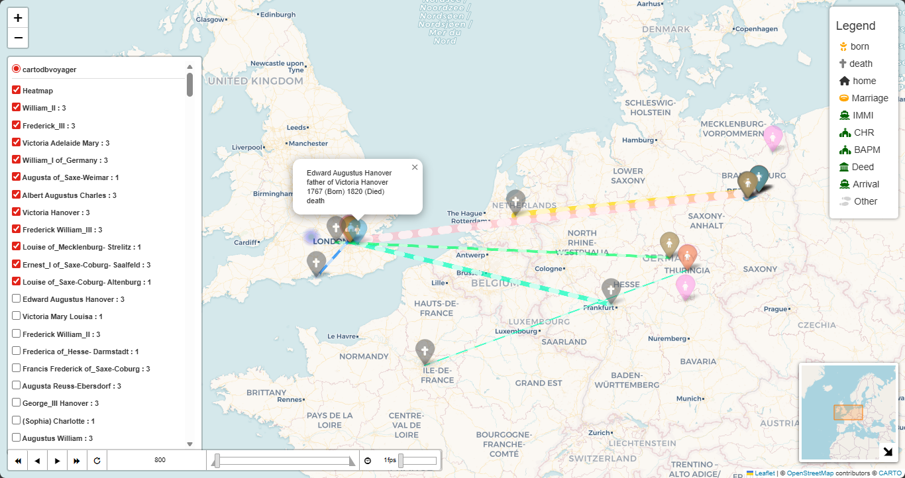
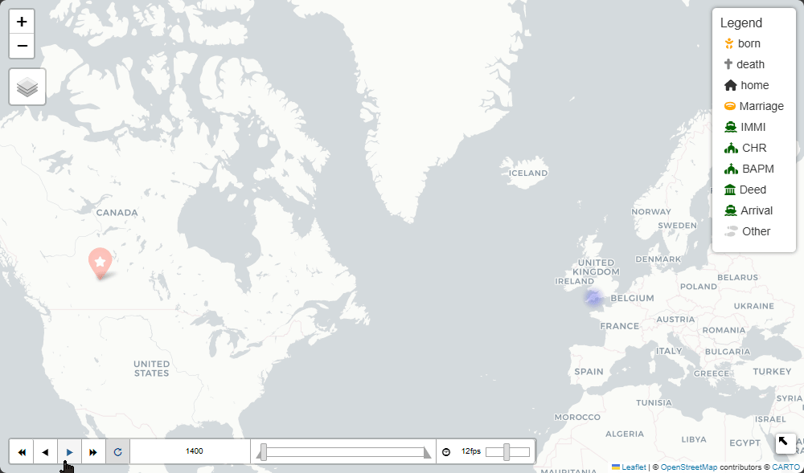
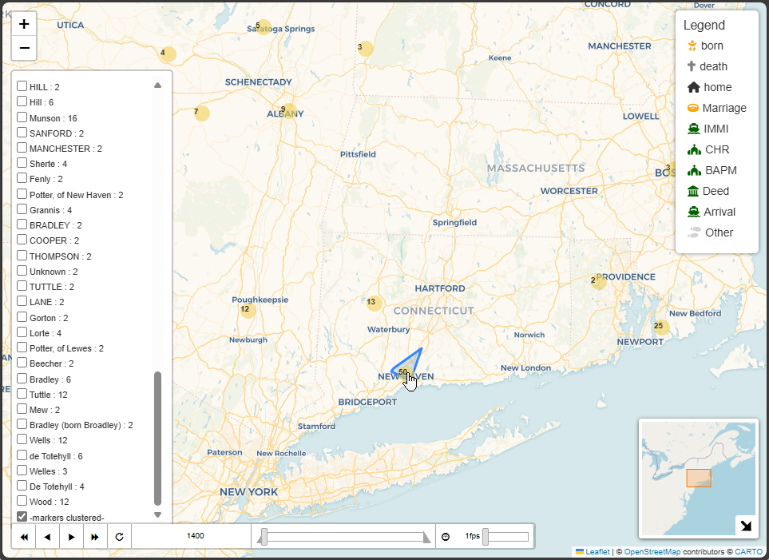

[![GitHub Activity][releases-shield]][releases]
[![License][license-shield]]([license])
![Project Maintenance][maintenance-shield]
[![GitHub Activity][commits-shield]][commits]


# gedcom-to-visualmap

Read a GEDCOM file and translate the locations into GPS addresses.

- Produces KML map types with timelines and movement visualization.
- Generates interactive HTML maps.
- Summarizes places and locations with high-accuracy geocoding.
- Visualizes family lineage—ascendants and descendants.
- Supports both command-line and GUI interfaces (GUI tested on Windows, macOS, and WSL).

Originally forked from [https://github.com/lmallez/gedcom-to-map], now in collaboration with [colin0brass](https://github.com/colin0brass).

---

## Who Should Try This

- Genealogy hobbyists wanting spatial context for life events.
- Historians and researchers mapping migrations and demographic clusters.
- Developers and data scientists seeking GEDCOM-derived geodata for analysis or visualization.

---

## Quick Start Tips

- Use the GUI to pick your GEDCOM, choose output type, then click Load to parse and resolve places.
- Double-left-click a person in the GUI list to set the starting person for traces and timelines.
- Edit `geo_cache.csv` to correct or refine geocoding, then save and re-run to apply fixes.
- Export KML to inspect results in Google Earth Pro, Google MyMaps, or ArcGIS Earth.
- Generate tables and CSV files listing people, places, and lifelines.

---

## How to Run

Assuming you have Python installed (see [Install-Python](https://github.com/PackeTsar/Install-Python#readme) if not):

1. **Clone the repository:**
    ```console
    git clone --recurse-submodules https://github.com/D-Jeffrey/gedcom-to-visualmap
    cd gedcom-to-visualmap
    git submodule update --init --recursive
    ```
    *Or download and unzip the latest [release](https://github.com/D-Jeffrey/gedcom-to-visualmap/releases).*
    *if you get an error because you have not setup git ssh then use the commands:
    ```console
    git clone --recurse-submodules https://github.com/D-Jeffrey/gedcom-to-visualmap
    cd gedcom-to-visualmap
    git config --global url."https://github.com/".insteadOf git@github.com:
    git submodule update --init --recursive
    ```

2. **Create and activate a virtual environment:**

    For Windows (PowerShell):
    ```console
    python3 -m venv venv
    venv\Scripts\activate.ps1
    ```

    For Linux and Mac:
    ```console
    python3 -m venv venv
    source venv/bin/activate
    ```

3. **Install dependencies:**
    ```console
    pip install -r requirements.txt
    pip install -r gedcom-to-map/geo_gedcom/requirements.txt
    ```

4. **Run the GUI interface:**
    ```console
    cd gedcom-to-map
    python3 gv.py
    ```
    *Or run the command-line interface:*
    ```console
    cd gedcom-to-map
    python3 gedcom-to-map.py /path/to/your.ged myTree -main "@I500003@"
    ```

5. **Update your code and dependencies:**
    ```console
    git config pull.rebase false https://github.com/D-Jeffrey/gedcom-to-visualmap
    git pull https://github.com/D-Jeffrey/gedcom-to-visualmap
    pip install -r requirements.txt
    pip install -r gedcom-to-map/geo_gedcom/requirements.txt
    ```

---

## GUI Overview



- Click `Input File` to select your .ged file.
- Set your options in the GUI.
- Click `Load` to parse and resolve addresses.
- Use `Draw Update` to save and view results.
- `Open GPS` opens the CSV in Excel (close it before re-running).
- `Stop` aborts loading without closing the GUI.
- Double-left-click a person to set the starting person for traces.
- Use `Geo Table` to edit and manage resolved/cached names.
- Use `Trace` to create a list of individuals from the starting person.
- Use `Browser` to open the last output HTML file.
- Right-click a person for details and geocoding info.

---

## Addresses and Alternative Address File

- `geo_cache.csv` is created automatically when addresses are looked up.
- You can use an alternative address file (e.g., `my_family.csv` for `my_family.ged`).
- Do not keep CSV files open in Excel or other apps while running the program.

---

## Results

### KML Example

- Google Earth Online:  
  
- Google Earth Pro:  
  
- ArcGIS Earth:  
  

### HTML Example

- 
- 
- 

### Heatmap Timeline

- 

### Cluster Markers

- 

---

## Parameter and Settings

- Set CSV or KML viewer in Options -> Setup.
- KML2 is an improved version of KML.
- SUM is a summary CSV and plot of birth vs death by continent/country.

---

## Running on Linux

- [See Running on WSL](docs/running-on-wsl.md)

---

## Other Ideas

- [See Exploring Family trees](docs/otherlearnings.md)

---

## Built Using

| Project         | GitHub Repo | Documentation | Purpose |
|-----------------|------------|---------------|---------|
| wxPython        | [Phoenix](https://github.com/wxWidgets/Phoenix) | [wxpython.org](https://wxpython.org/) | GUI toolkit |
| ged4py          | [ged4py](https://github.com/andy-z/ged4py) | [docs](https://simplekml.readthedocs.io/en/latest/) | GEDCOM parser |
| simplekml       | [simplekml](https://github.com/eisoldt/simplekml) | [docs](https://app.readthedocs.org/projects/simplekml/) | KML generation |
| geopy           | [geopy](https://github.com/geopy/geopy) | [docs](https://geopy.readthedocs.io/en/latest/#geocoders) | Geocoding |
| folium          | [folium](https://github.com/python-visualization/folium) | [docs](https://python-visualization.github.io/folium/latest/) | Interactive maps |
| xyzservices     | [xyzservices](https://github.com/geopandas/xyzservices) | [docs](https://xyzservices.readthedocs.io/en/stable/index.html) | Tile services |
| pyyaml          | [pyyaml](https://github.com/yaml/pyyaml) | | YAML processing |
| rapidfuzz       | [RapidFuzz](https://github.com/rapidfuzz/RapidFuzz) | | Fuzzy string matching |
| pycountry       | [pycountry](https://github.com/pycountry/pycountry) | | Country data |
| pycountry-convert | [pycountry-convert](https://github.com/jefftune/pycountry-convert) | | Country/continent conversion |
| pandas          | [pandas](https://github.com/pandas-dev/pandas) | | Data analysis |
| seaborn         | [seaborn](https://github.com/mwaskom/seaborn) | [docs](https://seaborn.pydata.org/) | Visualization |
| matplotlib      | [matplotlib](https://github.com/matplotlib/matplotlib) | [docs](https://matplotlib.org/) | Visualization |

---

## Testing

To run the test suite:
```sh
pytest
```
All core modules and models are covered by pytest-based tests. See the `tests/` and `models/tests/` directories for details.

# Running Address Book Performance Tests

To run the address book/geocoding performance test and see detailed output in the terminal, use:

```
pytest -s -m slow gedcom-to-map/tests/test_addressbook_performance.py
```

This test benchmarks address book and geocoding operations across multiple GEDCOM samples, for both fuzzy and exact matching. It prints a markdown table of results to the terminal and also writes structured results to `gedcom-to-map/tests/addressbook_performance_results.yaml` for further analysis.

The `-s` option ensures that all print statements from the test are shown in the terminal.

Note: It requires some geo_cache files that may not be checked-in to the repo by default, so you might need to generate them manually using the "SUM" output option first.

# Running GeolocatedGedcom Performance Tests

To run the GeolocatedGedcom initialization performance test:

```
pytest -s -m slow gedcom-to-map/tests/test_geolocatedgedcom_performance.py
```

This test measures the initialization time and basic stats for the `GeolocatedGedcom` class across the same set of GEDCOM samples, for both fuzzy and exact matching. It prints a markdown table of results to the terminal and writes structured results to `gedcom-to-map/tests/geolocatedgedcom_performance_results.yaml`.

## Running Slow/Performance Tests

Some tests are marked with the `@pytest.mark.slow` decorator to indicate that they are slow or intended for manual/performance runs only. By default, these tests are skipped unless explicitly requested.

To run only the slow tests:

```
pytest -m slow
```

To run all tests except those marked as slow:

```
pytest -m 'not slow'
```

To mark a test as slow, add the following decorator above your test function:

```python
import pytest

@pytest.mark.slow
```

You may want to register the marker in your `pytest.ini` to avoid warnings:

```
[pytest]
markers =
    slow: marks tests as slow (deselect with '-m "not slow"')
```

---

## Releases

See the [releases page](https://github.com/D-Jeffrey/gedcom-to-visualmap/releases) for detailed changelogs.

---

## Authors

- @colin0brass
- @lmallez
- @D-jeffrey

## License

See the main repository LICENSE.txt for details.

---

[license-shield]: https://img.shields.io/github/license/D-Jeffrey/gedcom-to-visualmap.svg?style=for-the-badge
[license]: LICENSE
[commits]: https://github.com/D-Jeffrey/gedcom-to-visualmap/commits
[commits-shield]: https://img.shields.io/github/commit-activity/y/D-Jeffrey/gedcom-to-visualmap?style=for-the-badge
[maintenance-shield]: https://img.shields.io/maintenance/yes/2025.svg?style=for-the-badge
[releases-shield]: https://img.shields.io/github/v/release/D-Jeffrey/gedcom-to-visualmap.svg?style=for-the-badge
[releases]: https://github.com/D-Jeffrey/gedcom-to-visualmap/releases
