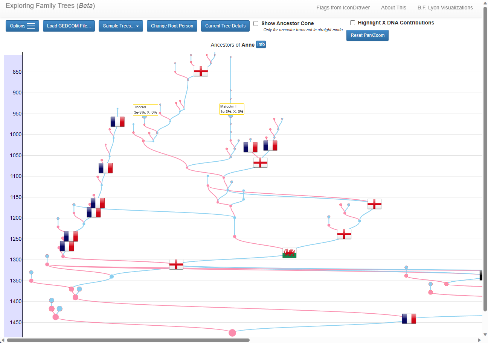

See you family tree as a graph branches by loading your gedcom into 

https://learnforeverlearn.com/ancestors/

## Visualizing my ancestry on a map
 (Dec 2020) this is an interesting approach
https://yannickbrouwer.medium.com/visualizing-my-ancestry-on-a-map-7af6a2354db0
https://github.com/yannickbrouwer/ancestors-migration-visualization

[Legacy Family Tree](https://legacyfamilytree.com/) This is great for plugging into  Family Search as it is one the few authorized applications allowed to pull history and hierarchy from Family Search.  I used it to go back 60 generation (which implies up to 60 ^ 4 = 12,960,000 direct ancestors assuming that no one was ever lost).  I ended up with about 132,000 ancestors for myself and my wife which took over 30 hours to gather.

## API and Applications for Family Searcch
- https://www.familysearch.org/en/developers/docs/api/resources
- https://www.familysearch.org/en/innovate/solutionsgallery/

Different Family Tree software chocies
https://www.amyjohnsoncrow.com/what-kind-of-online-family-tree-is-right-for-you/
- Online Family Tree
- Individual Family Tree on Someone’s Site
- Individual Family Tree on Your Own Site
- Collaborative Family Trees

## Timeslines to overlap with history at the time
https://progenygenealogy.com/downloads/timeline-files/

## MyHertiage Resarch
https://www.myheritage.com/research/catalog

## ERSI Story Maps
Go to https://storymaps.arcgis.com/
Sign up for an account and then you can create a map and a story such as:  https://storymaps.arcgis.com/stories/d022d3fa9877473990d2ccfb7d08a1f3/

### Return back to [README](../README.md)

