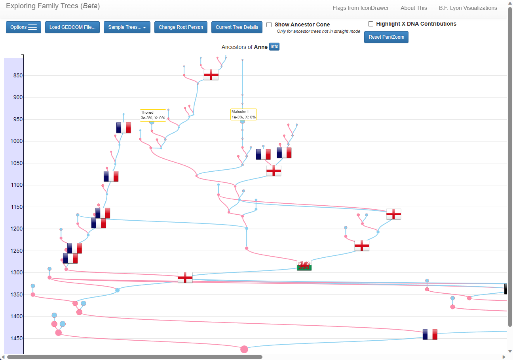

See you family tree as a graph branches by loading your gedcom into 

https://learnforeverlearn.com/ancestors/

Visualizing my ancestry on a map (Dec 2020)
https://yannickbrouwer.medium.com/visualizing-my-ancestry-on-a-map-7af6a2354db0
https://github.com/yannickbrouwer/ancestors-migration-visualization

Go to https://storymaps.arcgis.com/
Sign up for an account

https://storymaps.arcgis.com/stories/d022d3fa9877473990d2ccfb7d08a1f3/