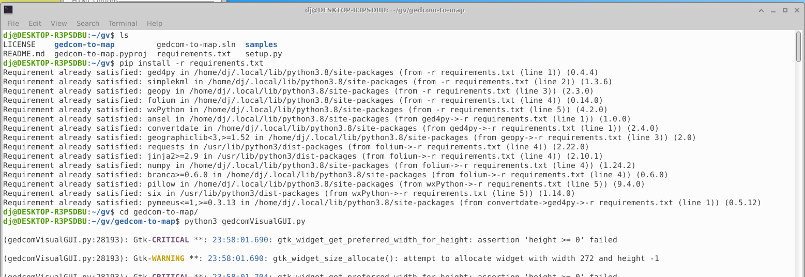
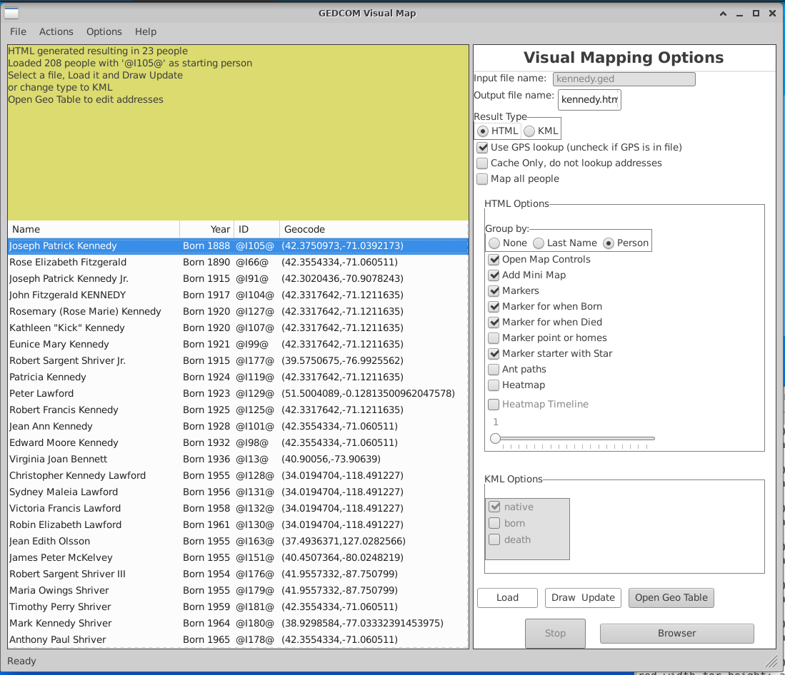
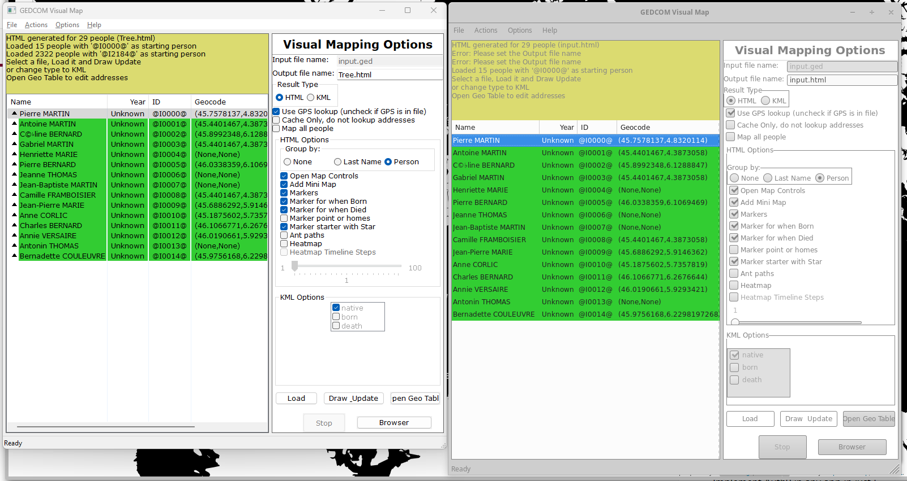

# Running gedcomVisualGUI on Linux (WSL)

### WIP, looking for feedback


## Linux (WSL - WSL version: 1.1.3.0)
  
```
sudo add-apt-repository ppa:deadsnakes/ppa
sudo apt-get update
sudo apt install python3.11
sudo update-alternatives --install /usr/bin/python3 python3 /usr/bin/python3.11 1
sudo update-alternatives --install /usr/bin/python3 python3 /usr/bin/python3.10 2
sudo update-alternatives --config python3
sudo apt install python3-pip
sudo apt install python3.10-venv
pip install -U six wheel setuptools
pip install --upgrade pip

```


This seems to work best...
```
sudo apt install xubuntu-desktop
```

Then you can use UXTerm from the Ubuntu menu of your windows Desktop (Slick)
I'm not sure if any of the steps below (Saved for reference) are required or they are covered by the desktop install

This seems to be the way people are going on Linux...

```
sudo apt-get install python3-venv

python3 -m venv gedcom-to-visualmap
source gedcom-to-visualmap/bin/activate
```

Do the install of `wxPython` to make sure it gets configured and setup correctly.   You may need to install or setup other
modules as above like (libgtk-3-dev).  I read that you should *not* every run `pip` with `sudo`

```
pip install wheel
# this attrdict3 is only required for WSL because of issues in the image
pip install -U attrdict3
pip install wxPython
pip install git+https://github.com/D-Jeffrey/gedcom-to-visualmap.git
```

I have not figured out how to use `venv` properly yet, so this a work in progres.

The egg seems to be generally working (thought I don't have a background understanding of eggs).  It appears eggs are obsolute.


##Running on Linux (WSL)
Using the steps of download and unzip release 0.2.1
```
pip install -U attrdict3
pip install wxPython
cd gedcom-to-visualmap
pip install -r requirements.txt
python3 gedcomVisualGUI.py 
```






Trying an alternate approach of:

```
sudo apt install xubuntu-desktop

```

Output from a download and run
```
dj@DESKTOP-R3PSDBU:~/gv$ tar -xf  ../Downloads/gedcom-to-visualmap-0.2.3.1.tar.gz 
dj@DESKTOP-R3PSDBU:~/gv$ ls
gedcom-to-visualmap-0.2.3.1
dj@DESKTOP-R3PSDBU:~/gv$ cd gedcom-to-visualmap-0.2.3.1/
dj@DESKTOP-R3PSDBU:~/gv/gedcom-to-visualmap-0.2.3.1$ ls
LICENSE    docs           gedcom-to-map.pyproj  img               samples
README.md  gedcom-to-map  gedcom-to-map.sln     requirements.txt  setup.py
dj@DESKTOP-R3PSDBU:~/gv/gedcom-to-visualmap-0.2.3.1$ pip install -r requirements.txt 
Requirement already satisfied: ged4py>=0.4.4 in /home/dj/.local/lib/python3.8/site-packages (from -r requirements.txt (line 1)) (0.4.4)
Requirement already satisfied: simplekml>=1.3.6 in /home/dj/.local/lib/python3.8/site-packages (from -r requirements.txt (line 2)) (1.3.6)
Requirement already satisfied: geopy>=2.3.0 in /home/dj/.local/lib/python3.8/site-packages (from -r requirements.txt (line 3)) (2.3.0)
Requirement already satisfied: folium>=0.14.0 in /home/dj/.local/lib/python3.8/site-packages (from -r requirements.txt (line 4)) (0.14.0)
Requirement already satisfied: wxPython>=4.1.0 in /home/dj/.local/lib/python3.8/site-packages (from -r requirements.txt (line 5)) (4.2.0)
Requirement already satisfied: convertdate in /home/dj/.local/lib/python3.8/site-packages (from ged4py>=0.4.4->-r requirements.txt (line 1)) (2.4.0)
Requirement already satisfied: ansel in /home/dj/.local/lib/python3.8/site-packages (from ged4py>=0.4.4->-r requirements.txt (line 1)) (1.0.0)
Requirement already satisfied: geographiclib<3,>=1.52 in /home/dj/.local/lib/python3.8/site-packages (from geopy>=2.3.0->-r requirements.txt (line 3)) (2.0)
Requirement already satisfied: requests in /usr/lib/python3/dist-packages (from folium>=0.14.0->-r requirements.txt (line 4)) (2.22.0)
Requirement already satisfied: numpy in /home/dj/.local/lib/python3.8/site-packages (from folium>=0.14.0->-r requirements.txt (line 4)) (1.24.2)
Requirement already satisfied: jinja2>=2.9 in /usr/lib/python3/dist-packages (from folium>=0.14.0->-r requirements.txt (line 4)) (2.10.1)
Requirement already satisfied: branca>=0.6.0 in /home/dj/.local/lib/python3.8/site-packages (from folium>=0.14.0->-r requirements.txt (line 4)) (0.6.0)
Requirement already satisfied: six in /usr/lib/python3/dist-packages (from wxPython>=4.1.0->-r requirements.txt (line 5)) (1.14.0)
Requirement already satisfied: pillow in /home/dj/.local/lib/python3.8/site-packages (from wxPython>=4.1.0->-r requirements.txt (line 5)) (9.4.0)
Requirement already satisfied: pymeeus<=1,>=0.3.13 in /home/dj/.local/lib/python3.8/site-packages (from convertdate->ged4py>=0.4.4->-r requirements.txt (line 1)) (0.5.12)
dj@DESKTOP-R3PSDBU:~/gv/gedcom-to-visualmap-0.2.3.1$ pwd
/home/dj/gv/gedcom-to-visualmap-0.2.3.1
dj@DESKTOP-R3PSDBU:~/gv/gedcom-to-visualmap-0.2.3.1$ ls
LICENSE    docs           gedcom-to-map.pyproj  img               samples
README.md  gedcom-to-map  gedcom-to-map.sln     requirements.txt  setup.py
dj@DESKTOP-R3PSDBU:~/gv/gedcom-to-visualmap-0.2.3.1$ python3 gedcom-to-map/gedcomVisualGUI.py 
01-04-2023 06:29:51 : INFO : gedcomVisualGUI : <module> : 1315 : Starting up gedcom-to-visualmap 0.2.3
01-04-2023 06:29:51 : INFO : gedcomVisualGUI : <module> : 1315 : Starting up gedcom-to-visualmap 0.2.3


```

## Side by side
Windows and Linux (WSL) running on Windows 11 - WSL 1.1.3.0 - Ubuntu 



# Saved for reference

I'm not sure if these steps are still required

This is to sets up and and installed X-Windows for WSL using xfce4 using the 
guidance from https://askubuntu.com/questions/1252007/opening-ubuntu-20-04-desktop-on-wsl2/1365455#1365455

```
sudo apt install pkg-config
sudo apt install libgtk-3-dev 

sudo apt install xrdp xfce4
# If asked, select lightdm, although it probably doesn't matter

# Optionally, back up the default config
sudo cp /etc/xrdp/xrdp.ini /etc/xrdp/xrdp.ini.bak
# Windows Pro and higher are often already running RDP on 3389
# Prevent conflicts:
sudo sed -i 's/3389/3390/g' /etc/xrdp/xrdp.ini

# Prevent Wayland from being used in Xrdp
echo "export WAYLAND_DISPLAY=" > ~/.xsessionrc

# Optional, if you only have one desktop environment installed
echo startxfce4 > ~/.xsession 
sudo service xrdp start

```
Now that you have X installed you can access it by logging into it view a Remote Desktop Connection to `localhost:3390`

You will be prompted for you WSL username and password.  (I login the Xorg as the Session type)
