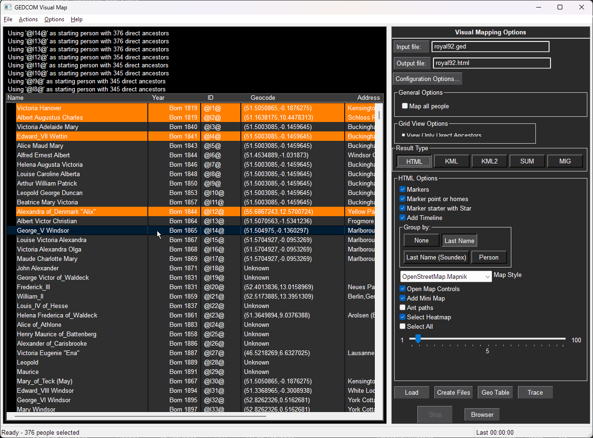
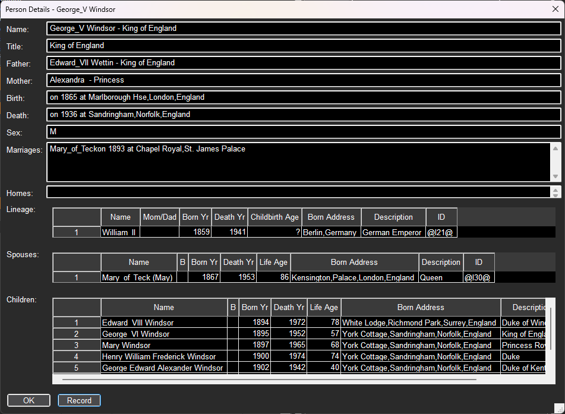
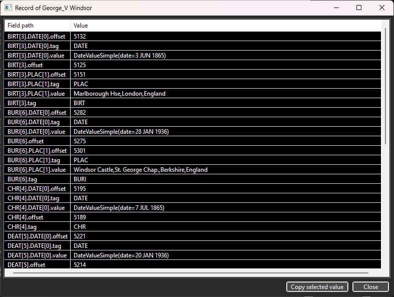
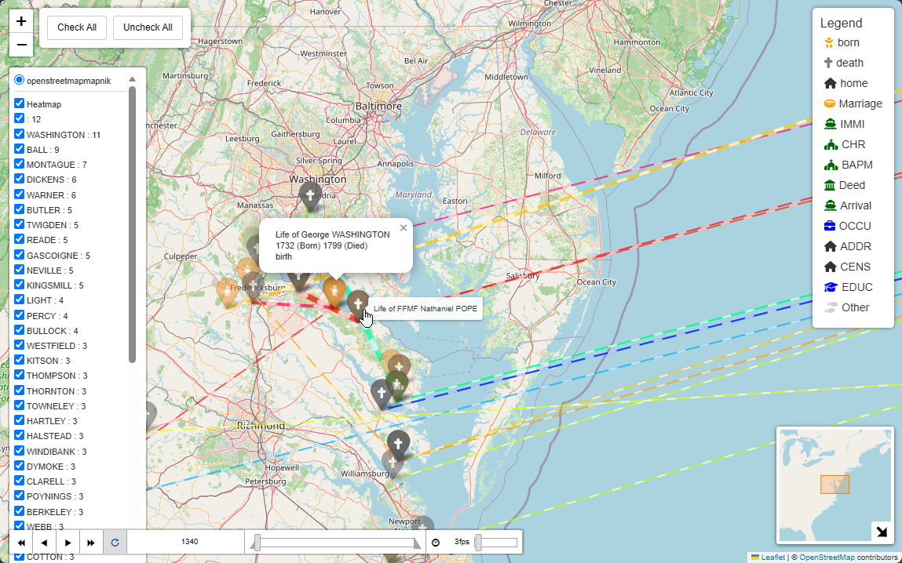
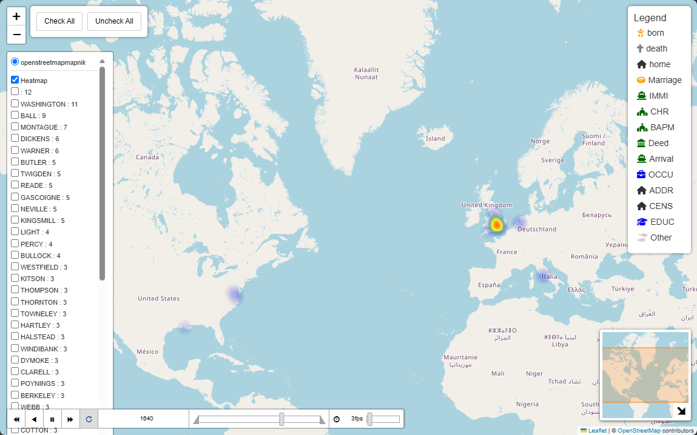
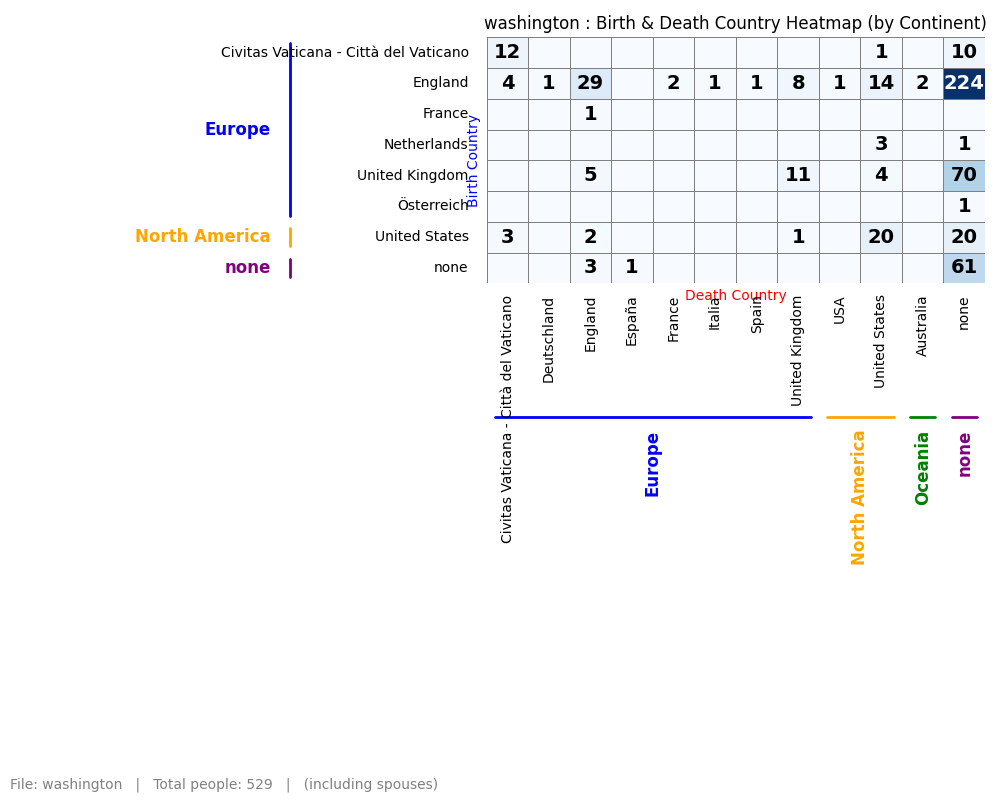
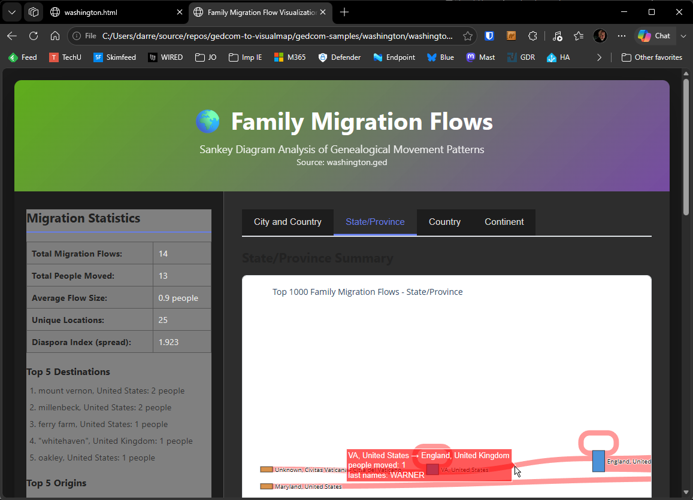
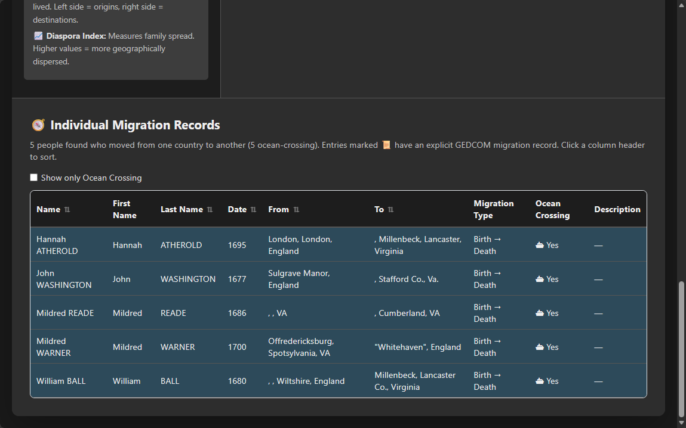

# Examples
### Example of output using Washington 
- source GED [washington.ged](https://github.com/D-Jeffrey/gedcom-samples/blob/main/washington/washington.ged)

### Loading up the GED file

### Looking at a person

#### Looking at the GED records

## HTML
- [HTML output for washington](examples/washington.html)

### with Ant tracks

### Heat Map

-

## KML type 1
- [KML output for washington](examples/washington-1.kml)

## KML type 2
- [KML output for washington](examples/washington-2.kml)

## Reporting details
#### Migration heatmap

#### People dump in CSV Format
- [washington_people.csv](examples/washington_people.csv)

#### Addresses dump in CSV format
- [washington_places](examples/washington_places.csv)
- [washington_alt_places](examples/washington_alt_places.csv)
- [washington_countries](examples/washington_countries.csv)
- [washington_enrichment_issues.csv](examples/washington_enrichment_issues.csv)

### Statistics
- [HTML format](examples/washington_statistics.html) 
- [YAML format](examples/washington_statistics.yaml)

- [Markdown Format](examples/washington_statistics.md)

## Migration Sankey

[washington_migration_sankey.html](examples/washington_migration_sankey.html)

Use the results to search passenger lists

